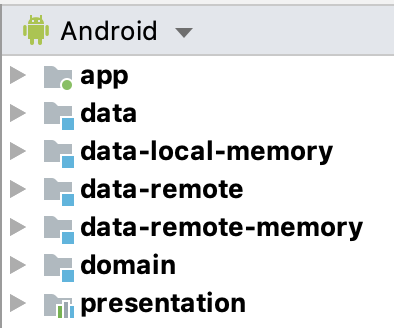
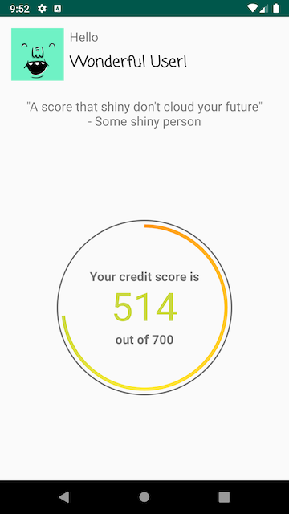
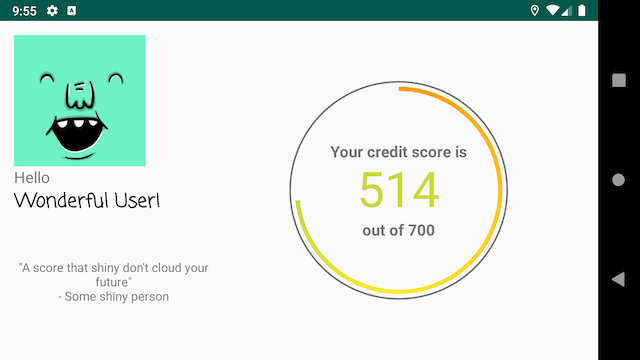

# ShinyScore

This demo app has the purpose of demonstrating knowledge over Android Development.

It is about to fetch a user credit report and display it. Currently is using a fictional and mocked server.

Tried to follow a Clean Architecture as described by [Robert C. Martin - Uncle Bob](https://twitter.com/unclebobmartin) in his [blog](https://blog.cleancoder.com/uncle-bob/2012/08/13/the-clean-architecture.html).

The project have different modules:



* __domain__ contains the `use cases` and the domain `models`, along with some `interfaces` defining the `repository` and `executor`. 
* __data__ held `interfaces` for the `data source`. Also contains an implementation of the `data repository` to be used in the above layers.
* __data-local-memory__ `data source` implementation for a local source of data, storing inMemory while the application is running.
* __data-remote__ `data source` implementation for the remote source of data, using `Retrofit` to execute HTTP requests, this currently implements the mocked `ShinyScore` source.
* __data-remote-memory__ `data source` implementation for the remote source of data, but using a local and inMemory random generator of results.
* __presentation__ responsible for managing the `state` of the views, contains the `ViewModel` implementations where will execute the `use cases` from domain and manage the `data` (to store, retrieve, etc.), signalling through the `state` of the `ViewModel` to the upper layers.
* __app__ consumer and "glue" of everything, will provide the DI required for each layer (using `Koin`), it is a mobile representation of `UI` (one of as many it could have - for example, another representation for TVs, another for Wearables, etc.). Here is the layer where make the interaction with the user and manage it, through the `ViewModel`s, the state of the application storing/retrieving data when required.

The `models` was applied as much as possible the Clean Architecture way, where each module have their own `model` representation with the required `mappers` between them (the "exception" is `app` module where "reuse" the `presentation`'s model)

It is understandable the approaches used here are an educational and "demoable" purpose, and in a real application some layers/representation can be "merged" together - as an example often implementation merges the `app` with the `presentation`. As the same case, in a real world after some iterations we could have the necessity of splitting modules.

Tried as much to use TDD as possible, I believe the coverage of the project is high, I did not generate the report, yet!

Sadly had "issues" with the AndroidX Fragments, where Roboletric isn't compatible (using the `FragmentController`). And the new `fragment-testing` was breaking the tests using Roboletric.

The app supports portrait and landscape modes:





__NOTE__: I'm not a great designer :upside_down_face: BUT when I get the design, usually I can deliver a really close match :nerd_face: 

# InMemory/Remote Data Source

You can switch between the inMemory remote data source and the "real" remote data source.

Go to the file `com/bertan/shinyscore/di/DataModule.kt` and use one of the following:

* For Remote data source
```
    single {
        RemoteDataSourceImpl(
            service = get()
        ) as RemoteDataSource
    }
//    single {
//        RemoteDataSourceMemoryImpl(
//            minReports = 1,
//            maxReports = 100
//        ) as RemoteDataSource
//    }
```

* For InMemory Remote data source generation random credit reports
```
//    single {
//        RemoteDataSourceImpl(
//            service = get()
//        ) as RemoteDataSource
//    }
    single {
        RemoteDataSourceMemoryImpl(
            minReports = 1,
            maxReports = 100
        ) as RemoteDataSource
    }
```

__NOTE__: It is important to use one OR another, not both at the same time ;)

# Libraries

* __RxJava__: More familiar with and most used in commercial applications. Was between this and Coroutines, but already picked the AndroidX as "leaving the comfort zone", so leaving the use of Coroutines for a Future application.
* __jUnit 4__: More familiar with and most used.
* __MockK__: This one is huge by affinity (and love), I was tired of `Mockito` not allowing me do some mocks, at the beginning also not working properly with Kotlin (where was in the end using along side other libraries), so cahnged everything and start to use MockK, and this changed my life! At my point of view, the test looks more "elegant", the DSL provided I feel more friendly. 
* __Moshi__: Not by affinity, since I have more affinity with `Gson`, using this because I saw in some Slack Channel someone speaking about it and went to try it out. 
* __okHttp__: One of the most used, using to create the client used with the `Retrofit`, and to add a logging interceptor when I'm in DEBUG.
* __Retrofit__: Choose by affinity, used to make http requests.
* __Picasso__: Whenever I need to load an URL into an `imageView`, first in my mind came `Picasso`, I indeed used before `Glide`, but usually pick `Picasso`, no strong reason.
* __Koin__: Have in the past more affinity with `Dagger`, try recently `Koin` and my world changed... In my opnion way more concise to use with the DSL, nice to create a factory for `viewModel`, and the code looks more "clean". I'm still a "beginner" with it, but so far, didn't have hard or complex issues (way different than starting with Dagger for example).
* __Roboletric__: It is a story of love and hate, I love in how easy is to use, to run a test in different configurations, api levels, and everything. But at the same time I hate the increase of timings to run it (had to confess it gets way faster than some previous versions).   
* __Espresso__: Having some affinity with Espresso, already spend some times writing my own Matchers, for me the tests with Espresso are "clean", you can see straight away what it is looking for and what is checking.

# Challenges

I decide to challenge myself in some places over this demo application. Could have used what I was more familiar, and make it quickier, but no, why make it trivial and not expand our knowledge? :)

Using AndroidX instead of Support libraries was one of the challenges, not so much since it works "smooth", until getting issues with the libraries used on the tests (the Fragments cases explained above).

Had issues using the Kotlin Synthetic Bindings: I like to use `groups` from `ContraintLayout`, so I used here some groups to represent the `Loading`, `Success` and `Error` states, handling in the Activity the visibility of each state. So far so good, until I did the same in the Fragment, which the Activity loads... Weird behaviours were happening because both `groups` have the same ids (being used in different classes and proper referenced by the synthetic import), but in Runtime, it went in crazy mode. Got me for some good time this one, until I realize the issue and ending in rename the groups within the Fragment...

- I think this one I could "pass" if went to use the "shiny" new `ConstraintLayoutStates`.

Was a huge challenge trying to get the right colour for the credit score text... Did some experiments trying to write my own Interpolator, almost worked, for some values was perfect! But for others got colours way off the expected (like purple when I want was green...), at the end discovered the really cool `ColorUtils`, which have other nice to know methods as well.

# Future

- It is planned to add in the demo app a Login/Register screen as the first contact with the User. - This is prepared on the layers below `app` module, where already have the model, use case, data and presentation to have the interaction, need to hook UI to, at least, store locally those information.

- Complete the test suite, having tests for the Fragment and its components.

- Abstract Picasso until for the code is agnostic who is performing the fetch of images (currently in some tests need to mock statically - and we shouldn't do this).

- Extract the `score_component` into its own custom view.

- Extract the logic for colours of the score into the presentation layer (as before I was having in mind to have the concept of `ReportAsset`, which dictates the colours and styles to display a report, but dropped the idea to simplify the example, at this moment).

- Try to use `ConstraintLayoutStates` to get rid of the `groups` to manage states.

- Add `Room` as persistence for `data-local`. 

- Change from `RxJava` to `Coroutines`.